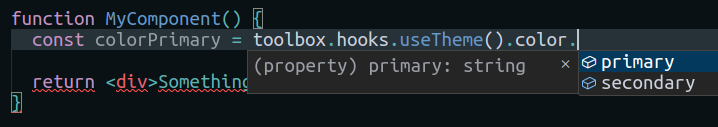
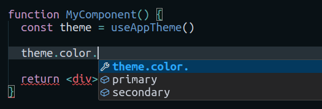

# React Toolbox

A set of React components and helpers for productive codebases.

## Installation

```
npm i @productive-codebases/react-toolbox --save
```

## Summary

React Toolbox is a compact library offering shared components and tools for React. It's customizable and extensible, enabling uniform setups across your projects.

## Getting started

### Create a new configuration

A configuration is an object that extends the [`IConfiguration`](https://github.com/productive-codebases/react-toolbox/blob/main/src/types/index.ts#L19-L29) interface.

Example:

```ts
import { createConfiguration } from '@productive-codebases/react-toolbox'

const appConfiguration = createConfiguration({
  loggerMapping: {
    AppSample: {
      components: 'components',
      stores: 'stores',
    }
  },
  theme: {
    color: {
      primary: 'blue',
      secondary: 'silver'
    },
    sizes: {
      small: '5px',
      default: '10px',
      large: '15px'
    }
  },
  roles: {
    'container/portal': 'container/portal',
    'container/modal': 'container/modal'
  },
  portalNames: {
    leftNavigation: 'leftNavigation',
    rightSideBar: 'rightSideBar'
  }
})
```

Create the toolbox:

```ts
export const toolbox = createToolbox('app', appConfiguration)
```

That's it! You have now your toolbox exposing various components, hooks and functions bounded to the configuration parameters.

Usage example:



### Destructure for easier imports

To enhance import clarity, you can destructure the toolbox into named exports.

```ts
// myapp/libs/reactToolbox.ts

export const {
  components: {
    ProviderNamedContext: ProviderApp,
    ContainerFlex,
    Portal,
    PortalPlaceHolder
  },
  hooks: {
    useNamedContext: useAppContext,
    useLogger: useAppLogger,
    useTheme: useAppTheme
  },
  helpers: {
    getDataTestAttributeProp: getAppDataTestAttributeProp,
    getDataTestAttributeValue: getAppDataTestAttributeValue
  }
} = createToolbox('app', appConfiguration)
```

And just import as it:

```ts
import { useAppTheme } from '@/myapp/libs/reactToolbox'
```

Usage example:



## Toolbox exports

### Components

#### ProviderNameContext

WIP

#### ContainerFlex

WIP

#### PortalPlaceHolder

WIP

#### Portal

WIP

### Hooks

#### useNamedContext

WIP

#### useLogger

WIP

#### useTheme

WIP

### Helpers

#### getDataTestAttributeValue

WIP

#### getDataTestAttributeProp

WIP
